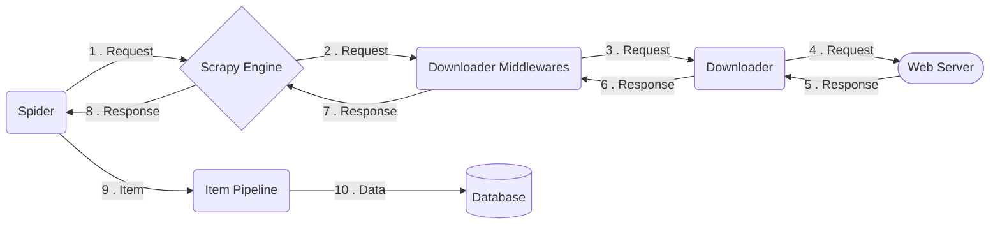

<p align="left"></p>

## Table of contents

* [Task Description](#task-description)
* [Project Overview](#project-overview)
* [Folder Structure](#folder-structure)
* [Scrapy Architecture Diagram](#scrapy-architecture-diagram)
* [Scrapy Execution Flow](#scrapy-execution-flow)
* [Setup](#setup)
* [Useful Stuff](#useful-stuff)

---

## Task Description

> 🤖 AI tools are allowed, but be able to answer questions around Scrapy and the problems you faced during the process

#### 1. Introduction

- Using the python Scrapy framework, go to https://www2.hm.com/bg_bg/productpage.1274171042.html
  and retrieve **single** product information about its:
    - name
    - selected color
    - available colors
    - price
    - reviews data

<br>

#### 2. The solution should include:

- the navigation to the product page
- extraction of the data
- Output of the parsed data needs to be in a JSON file.

<br>

#### 3. The following steps need to be implemented:

- request to load the page located at https://www2.hm.com/bg_bg/productpage.1274171042.html
- parse of the HTML
- collect the data:
    - name
    - price
    - selected default color
    - available colors
    - review count + review score
    - output the data as a JSON file, for example:
        ```json
        {
          "name": "String",
          "price": "Decimal",
          "current_color": "String",
          "available_colors": "Array",
          "reviews_count": "Integer",
          "reviews_score": "Double"
        }
        ```

[↑ Back to Top](#table-of-contents)

---

## Project Overview

#### Summary:

- Web scraper for extracting product data from H&M's website.
  Developed as a practical introduction to scraping with Scrapy, facing
  real-world challenges such as anti-bot protection, proxy usage, and data processing.

#### Tech:

-  Scrapy
   Playwright
   PostgreSQL
   Docker

#### Key Technical Implementations:

- **User-Agent Rotation:** Integrated [RandomUserAgentMiddleware](hm_scraper/hm_scraper/settings.py) that rotates
  between 2,000+ browser identifiers, preventing
  fingerprinting.  
  <br>
- **Proxy IP Rotation:** Integrated proxy rotation to avoid IP-based blocks.
    - *Note:* Despite testing 3 providers, H&M's protection currently holds the line.
    - *Status:* Ongoing development is tracked on
      the [feat/proxy](https://github.com/miray-mustafov/hm_product_scraper_miray_mustafov/tree/feat/proxy) branch.  
      <br>
- **PyCharm Debugger Configuration:** For convenient Scrapy execution debugging [.run](.run)  
  <br>
- **Database**: Implemented a [SaveToRDBMSPipeline](hm_scraper/hm_scraper/pipelines.py) that loads
  the item data in a `PostgreSQL` database running on a `Docker` container
    - *Note:* Current database schema is simplified for initial setup testing. It can be optimized
      by normalization techniques (one-to-many relationships, many-to-many junction tables, etc.)  
      <br>
- **Error handling & Logging**: For stability, debugging, monitoring, tracability  
  [SaveToRDBMSPipeline](hm_scraper/hm_scraper/pipelines.py), [@staticmethods](hm_scraper/hm_scraper/spiders/product_spider.py)  
  <br>
- **Memory Efficiency**: Used a **Generator** to pass urls one by one, avoiding loading full URL lists into RAM.  
  [yield_urls_for_scraping()](hm_scraper/hm_scraper/utils.py)

#### Upcoming Features:

- Ruff code formatting, Testing, CI/CD, Deployment

[↑ Back to Top](#table-of-contents)

---

## Folder Structure

```shell
hm_product_scraper_miray_mustafov/
├── hm_scraper/                     # project source root directory (contains scrapy.cfg)
│   ├── hm_scraper/                 # project's python module (actual app code)
│   │   ├── database.py             # [Load] db access layer
│   │   ├── items.py                # templates for how our items/products should look
│   │   ├── middlewares.py          # hooks for modifying requests/responses
│   │   ├── pipelines.py            # [Transform] logic for processing scraped items
│   │   ├── settings.py             # global configurations for the app
│   │   └── spiders/                # [Extract] data
│   │       ├── product_spider.py   # main spider to crawl and parse H&M products
│   ├── results/                    # place for the export results (JSON, CSV, etc.)
│   └── scrapy.cfg                  
```

Helper terminal command for generating the tree:

```
uv run python -m directory_tree -I temporary .venv media __pycache__ __init__.py
```

[↑ Back to Top](#table-of-contents)

---

## Scrapy Architecture Diagram



## Scrapy Execution Flow

1. **Spider Request**: [Spider.start_requests()](hm_scraper/hm_scraper/spiders/product_spider.py)  
   The spider is initialized with `settings.py` and creates a request object with:
    - URL
    - HTTP method
    - headers (e.g. User-Agent, Accept)
    - callback (specify a parse method that will handle the response later)
    - etc.

   The request is passed to the Scrapy Engine

<br>

2. **Scrapy Engine**:  
   Controlls data flow between all components and triggers actions on certain events.

<br>

3. **Request processing**: [process_request() in middlewares.py](hm_scraper/hm_scraper/middlewares.py)  
   The requests are processed by the downloader middlewares f.e.:
    - changing/rotating request headers like user-agent
    - retrying failed requests
    - dealing with anti-bot behavior

   Then the request is sent by the downloader engine in the network layer.

<br>

4. **Response receiving**: [process_response() in middlewares.py](hm_scraper/hm_scraper/middlewares.py)  
   The downloader receives the response and passes it to downloader middlewares that do processing like:
    - detecting bad responses
    - applying security logic
    - blocking/filtering pages you don’t want

   Then the response is sent to the spider for parsing/processing.

<br>

5. **Response parsing**: [Spider.parse()](hm_scraper/hm_scraper/spiders/product_spider.py)  
   The spider parses the response and extracts items/data, which are then passed to the item pipeline.

<br>

6. **Item processing**: [pipelines.py](hm_scraper/hm_scraper/pipelines.py)  
   The item pipeline processes the item
    - transformation, validation, cleaning, storage (DB, file), etc.

<br>

7. **Closing**:  
   When no more requests remain, the spider and downloader are closed and the process ends.

[↑ Back to Top](#table-of-contents)

---

## Setup

<span style="color: #888; font-size: 12px;">Local setup for Windows OS</span>

#### Open the terminal, navigate to a desired folder, and pull the project:

```shell
git clone git@github.com:miray-mustafov/hm_product_scraper_miray_mustafov.git
```

<br>

#### Navigate to the root level of the project:

```shell
cd hm_product_scraper_miray_mustafov
```

<br>

#### Configure and activate python virtual environment

- If uv not installed:

```
powershell -ExecutionPolicy ByPass -c "irm https://astral.sh/uv/install.ps1 | iex"
```

- Then:

```shell
uv venv --python 3.13
.venv\Scripts\activate
```

<br>

#### Install dependencies:

```shell
uv sync
```

<br>

#### Install Playwright binaries for launching a browser app:

```shell
uv run playwright install chromium
```

- they will be stored on your computer somewhere at:  
  `C:\Users\<user>\AppData\Local\ms-playwright`

<br>

#### Create a copy of `.env.example` file and name it `.env`:

<br>

#### 🚀 Run the app from `hm_product_scraper_miray_mustafov/hm_scraper`:

```shell
uv run scrapy crawl product_spider -O results/products_data_result.json
```

> Results will be saved here: 📂 [results](hm_scraper/results)

<br>

#### If you want to set up also the PostgreSQL database with Docker

1. Make sure Docker Desktop is installed and running.
2. Create a `.env` file in the project root by copying `.env.example`.
3. [Optional] Update the database values in `.env`.
4. Create the PostgreSQL container using the command from [.env.example](.env.example).

[↑ Back to Top](#table-of-contents)

---

## Useful Stuff

- How to initialize a scrapy project:  
  ```scrapy startproject <project_name>```


- How to initialize a scrapy spider:  
  ```scrapy genspider <spider_name> <your.website.com>```  
  ```scrapy genspider product_spider hm.com```


- How to start scrapy shell:  
  ```scrapy shell```


- How to request a URL in Scrapy shell and select elements:  
  ```fetch('<your_url>')``` creates response object  
  ```products = response.css('product-item')```

[↑ Back to Top](#table-of-contents)

---
